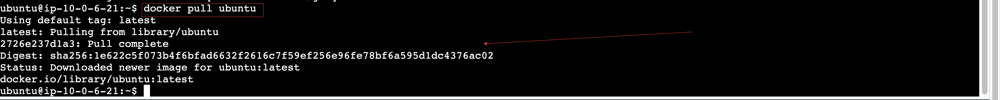
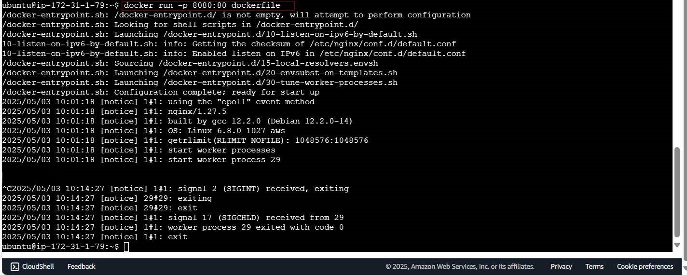
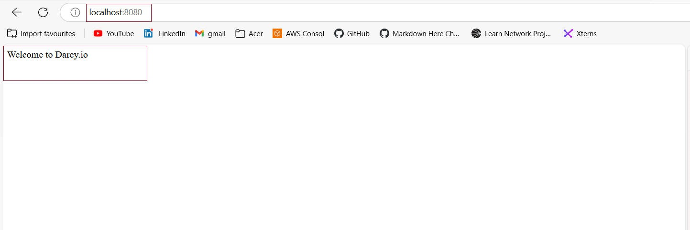
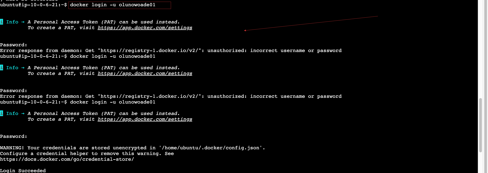
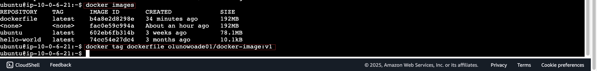
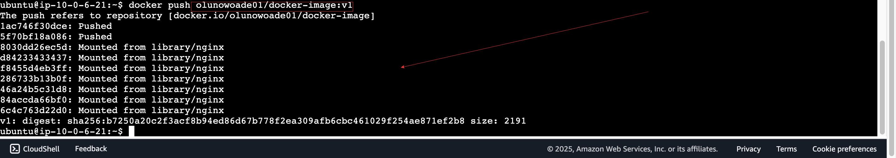

# Docker-Image Project

## Introduction

This project demonstrates the process of working with Docker images and containers, from pulling an image to managing and cleaning up containers. Docker is a powerful tool for containerization, enabling developers to package applications and their dependencies into lightweight, portable containers. This guide provides a step-by-step walkthrough of essential Docker commands and concepts, illustrated with images for better understanding.

---

## Steps and Explanations

### 1. Pulling a Docker Image

*Pulling a Docker image from a repository.*

To begin working with Docker, you first need to pull an image from a container registry such as Docker Hub. This is done using the `docker pull` command:
```bash
docker pull ubuntu
```

### 2. Verifying the Pulled Docker Image

- Verifying the presence of the newly pulled Docker image.



- After pulling an image, you can verify that it has been successfully downloaded to your system.

### 3. Listing Available Docker Images
- Listing all Docker images available on your local machine.


- Use the following command `docker images` to list all locally available images:

### 4. Viewing the Dockerfile

- Examining the Dockerfile used to create a custom image

- A Dockerfile contains a series of instructions that define how to build a Docker image. It outlines the base image, dependencies, configuration files, commands to run, and other setup steps.


- Verifying file permissions to ensure the Dockerfile is accessible and modifiable.

- Permissions determine who can read, write, or execute the file

### 5. Checking File Permissions


### 6. Building a Docker Image

- Creating a Docker image from a Dockerfile.

Run the following command `docker build -t my-custom-image .` to build an image from a Dockerfile:


### 7. Inspecting Security Group Settings

- This step is essential when deploying Docker containers on cloud platforms like AWS or Azure. Ensure the correct ports are open to allow external access.


### 8. Launching a Container

- Launching a container instance based on your custom Docker image.

Using command `docker run -d -p 80:80 my-custom-image`



### 9. Listing Running Docker Containers

- Displaying currently running containers.


Using command `docker ps`

### 10. Inspecting Container Details

- Reviewing detailed container settings and configuration.

- To examine container properties


### 11. Accessing the Container's Shell

- Entering the container's terminal for troubleshooting or administration.



### 12. Testing the Application

- Accessing the application via browser or terminal to confirm functionality.

Test by visiting `http://localhost` (or the container’s IP) in your browser, or using curl from the terminal.


* Testing the application running inside the container.*

### 13. Stopping a Running Docker Container

Gracefully shutting down a running container.

To stop a container:


*Stopping a running Docker container.*
Using command `docker stop <container_id>`

### 14. Removing Unused Docker Containers

- Removing stopped containers to free up system resources.

Using command `docker container prune`


* Removing unused Docker containers.*

### 15. Verifying the Final Docker Image

- Final check to ensure your custom image is clean, functional, and ready for reuse or deployment.

You can now confidently push the image to a registry or use it for deployment in staging/production environments.


## Docker containers and simple command.

- Project Topic 

1. Start a Container and Run a Simple Command
2. Stop the Container and Verify Its Status
3. Restart the Container and Observe Changes
4. Remove the Container

- Starting a Docker container.

### 1. Start a Container and Run a Simple Command

*Starting a Docker container and running a simple command.*

To start a container and run a simple command, use the following:
```bash
docker run -it ubuntu uname -a
```

### 2. Stop the Container and Verify Its Status

- Stopping a running Docker container.

This image demonstrates stopping a running container using the `docker stop` command. After stopping the container, its status can be verified using the `docker ps` command to ensure it is no longer active.

### 3. Restart the Container and Observe Changes

-Restarting a Docker container.

Here, the container is restarted using the `docker start` command. This step is useful for observing changes or resuming operations after a container has been stopped.

### 4. Remove the Container

- Removing a Docker container.

- This image shows the process of removing a stopped container using the `docker rm` command. Removing unused containers helps free up system resources and maintain a clean environment.

- This image demonstrates the ⁠ docker rm ⁠ command, which is used to delete a stopped container. Ensure the container is not running before attempting to remove it.


Conclusion
This Docker Image Project provides a practical, end-to-end guide for understanding and mastering Docker’s core features. From pulling base images to building custom containers and managing resources, it covers the full Docker development cycle. Special attention is given to:

Image creation and verification

Working with Dockerfiles

Container management and networking

Shell access for debugging

Cleanup and resource optimization

By completing this workflow, you’ll develop a solid foundation in Docker, allowing you to build more reliable, portable, and scalable application environments. This hands-on knowledge is especially valuable for developers, DevOps engineers, and anyone working with cloud-native technologies.

## Summary

The Docker-Image Project provides a detailed guide to understanding and working with Docker images and containers. It covers the entire lifecycle of a Docker workflow, starting from pulling an image from a repository to managing containers and cleaning up resources. Key steps include verifying images, building custom images using a Dockerfile, launching and managing containers, inspecting container details, and testing applications running inside containers. The guide also emphasizes best practices, such as checking file permissions, stopping unused containers, and verifying the final image after cleanup.

By following this project, users can gain hands-on experience with Docker's core functionalities, enabling them to efficiently containerize applications and streamline their development and deployment processes.